## 基于ES6的python解释器

小组成员：

聂小涛，学号：3130104419   
林远，学号：3130102116
赵顾阳，学号：3140102757    
(备注：和fm网站上面稍有出入，fm网站上面无法更改，请老师以此为准，谢谢)

### 目录

* 实现简介
* 样例演示
* 实现过程
	* 代码清理
	* token生成
	* AST树
	* 解析执行
* 组员分工

### 实现简介

我们实现的python解释器主要有以下几个特点：

* 基于ECMAscript2015(ES6)和nodejs
* 基于模块加载
* 将函数看作一等公民
* 没有声明提前
* 动态类型语言(变量无类型,值有类型)

总共实现了以下功能：

* 支持number、string、list、tuple、set、map、function
* 支持"+","-","*","/","%",">","<","=="等基本运算
* 支持部分python内置函数(pow、len、max、min)
* 总体实现的有：
  变量初始化、赋值、调用、运算、逻辑(三目运算、if...else...、while、for循环[增加写法])、函数、函数调用、数据结构(list、tuple、set、map以及其引用、成员方法)、注释(两种)、部分错误处理
  
**在实现过程中，代码清理、生成token、解析token以及生成AST树的过程均为自行开发，没有参考任何第三方代码，在AST树的解析过程中，参考了prython.js,Uglify.js等开源库，由于我们采用的是ES6语法，所以该部分在参考开源代码的情况下采用ES6进行了改写**  

另外我们实现的python解释器秉承多步骤复合增强的理念，每一步骤的解析结果均结合上下文进行处理。即我们在每一个步骤中都有进行错误判断并错误处理，在token处理的过程中维护变量栈，并不是完全上下文无关，在token解析生成AST树的过程中做了绝大多数错误处理，比如函数调用范围的错误，变量使用范围的错误，即时报错，这样可以有效提高解释器的效率，并且能够进行分工难度分散以及每个组员对整体逻辑的把握，便于大家分工协作。


### 样例展示

我们在实现的过程中将输出直接输出控制台，以下是我们的一些样例展示。

* 基本的赋值，输出语句：

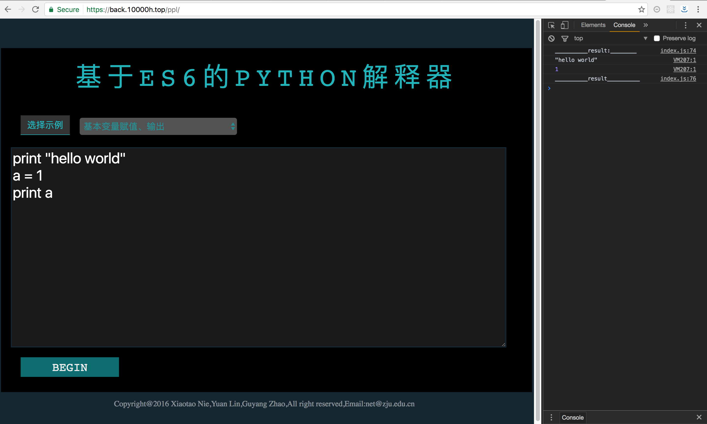

* 变量运算操作，复杂表达式的运算，三目运算符：

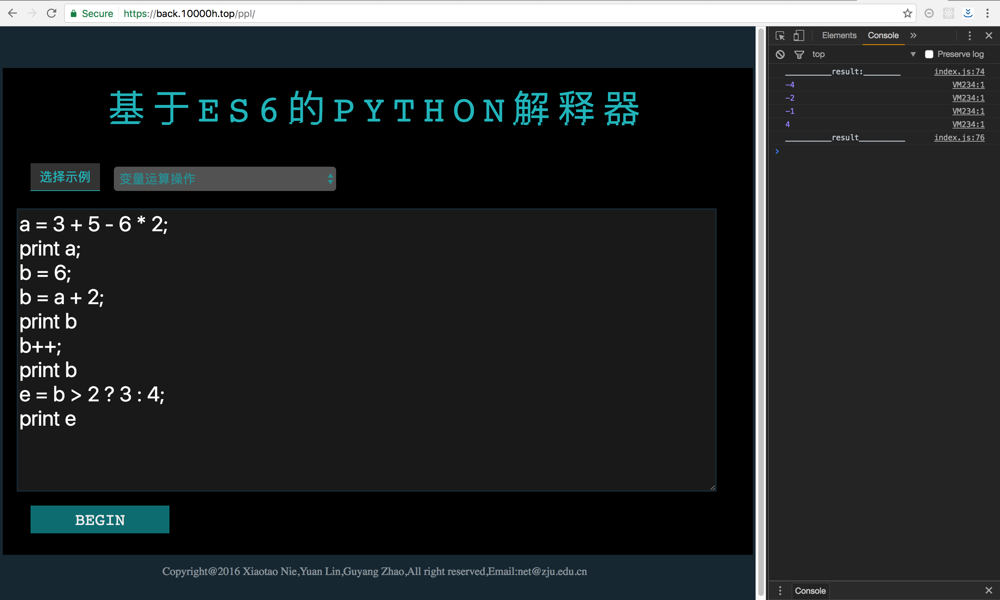

* 逻辑操作：if...else...，带有嵌套的if...else...以及elif：

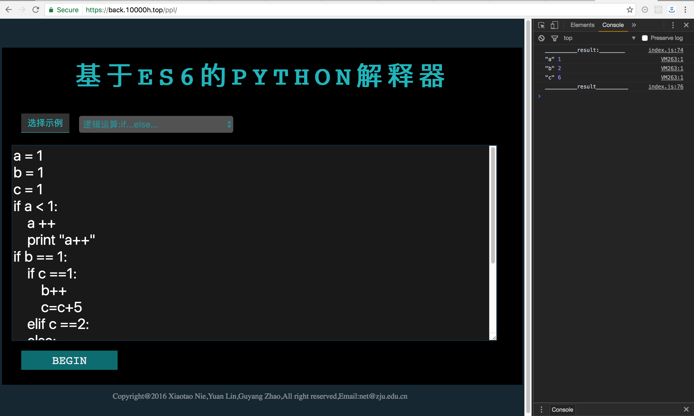

* 逻辑操作：while循环

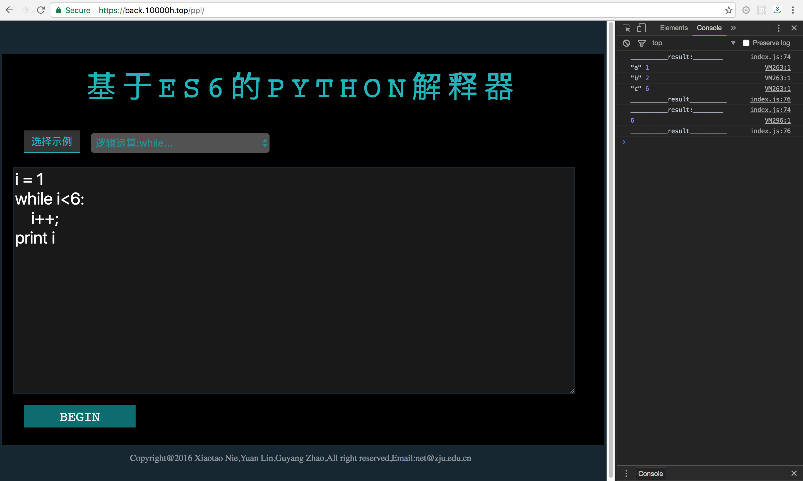

* 逻辑操作：for循环(此种for循环为我们增强实现的部分,考虑到很多编程语言建议采用此种for循环，我们在此进行实现)

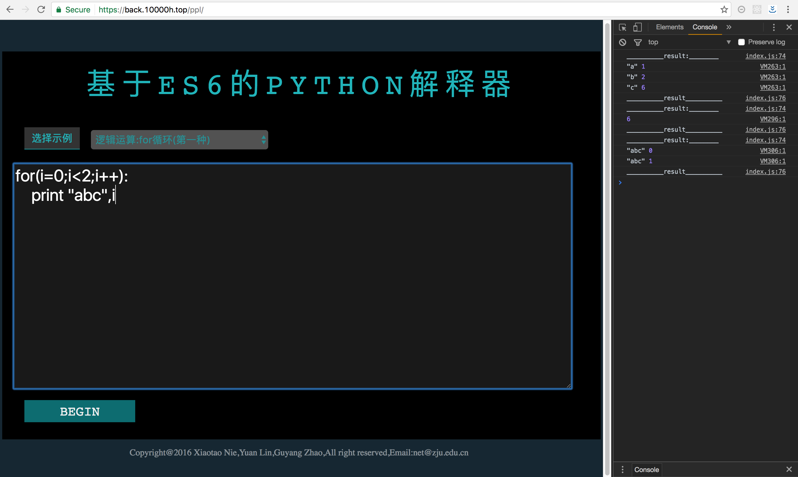

* 逻辑操作：for循环：其中的range函数我们用js进行了重写

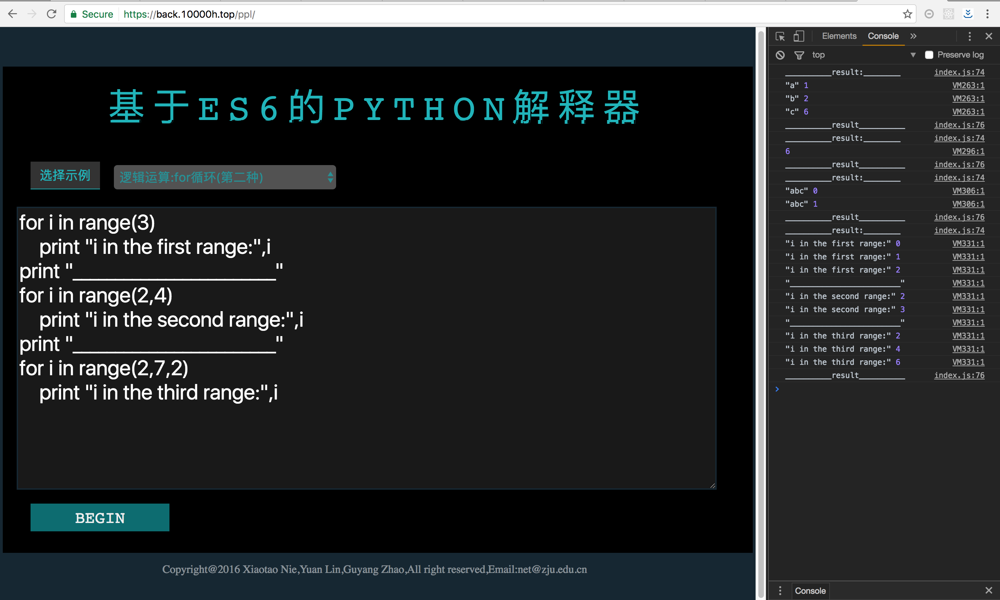

* 函数的定义和调用：函数可以访问全局变量，也可以维护局部变量：

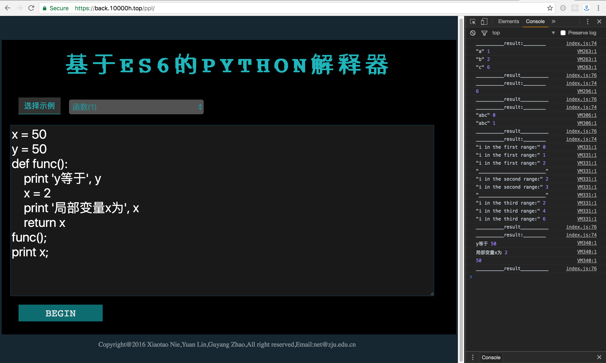

* 函数的定义和调用：由于在我们的实现中函数是一等公民，因此可以像变量一样到处调用：

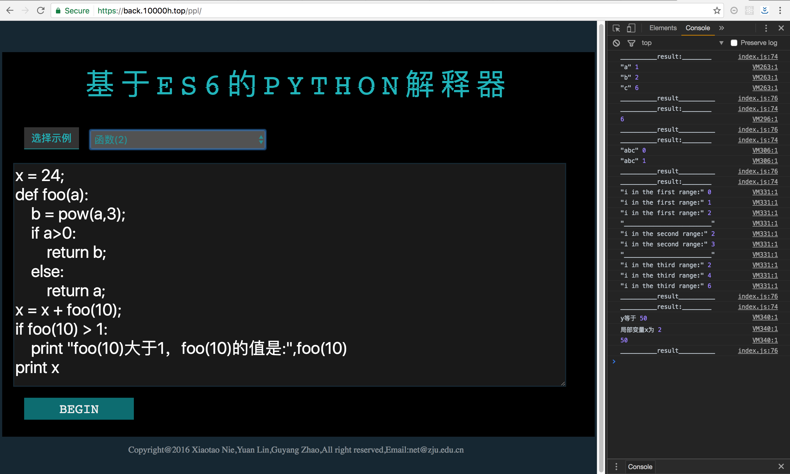

* list：我们用js重写了list的一些方法

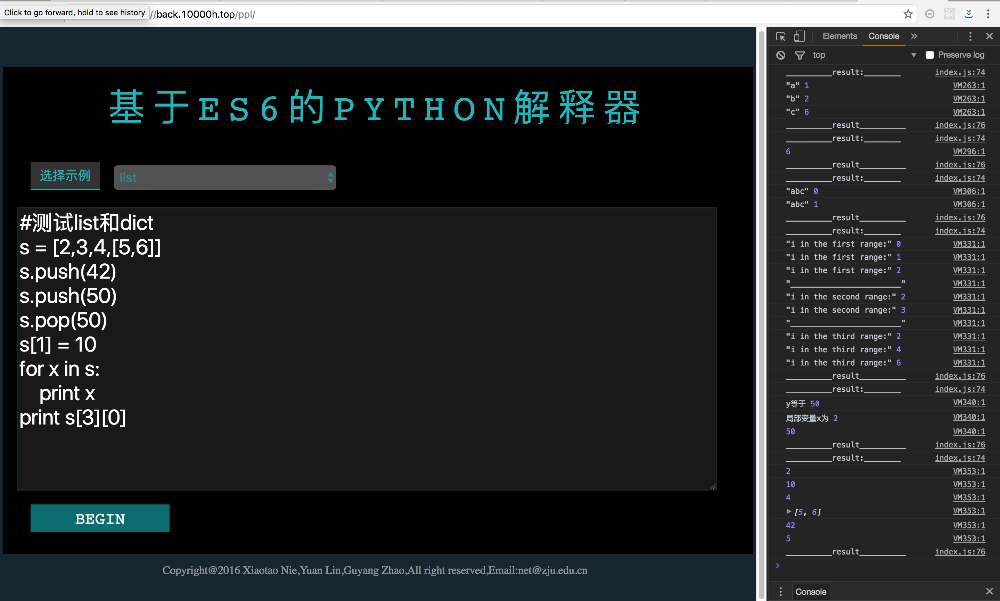

* dict: dict在这里我们的实现过程实际上是一个语法糖，每一个键值对表示为一个两个元素的数组，整体是一个二维数组，我们同样用js重写了一些方法：

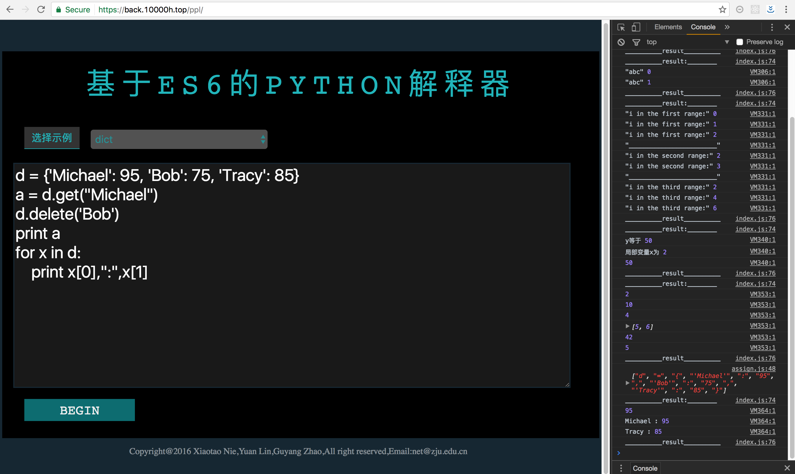

* set：set可以去除重复内容

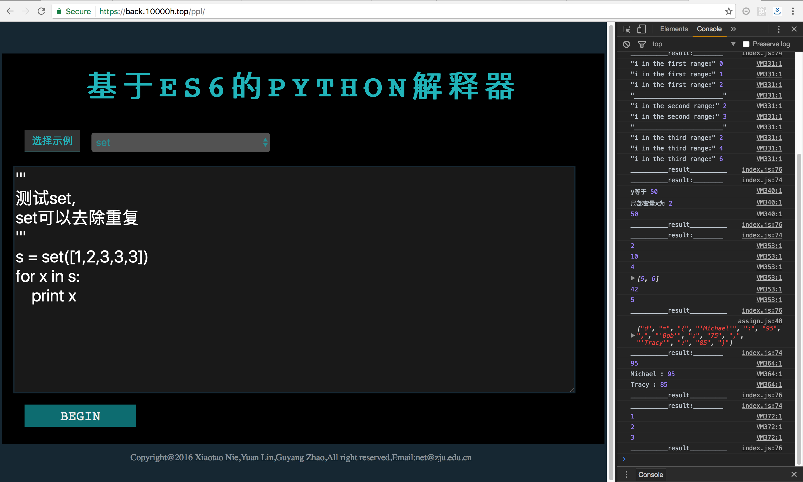

* tuple：tuple是不能够修改内容的

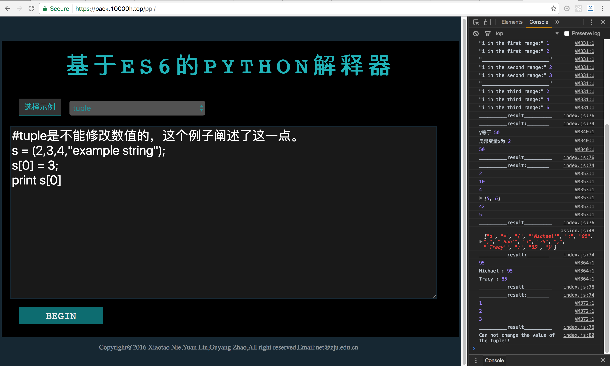

* 错误处理1: 使用保留字/关键字定义会报错：

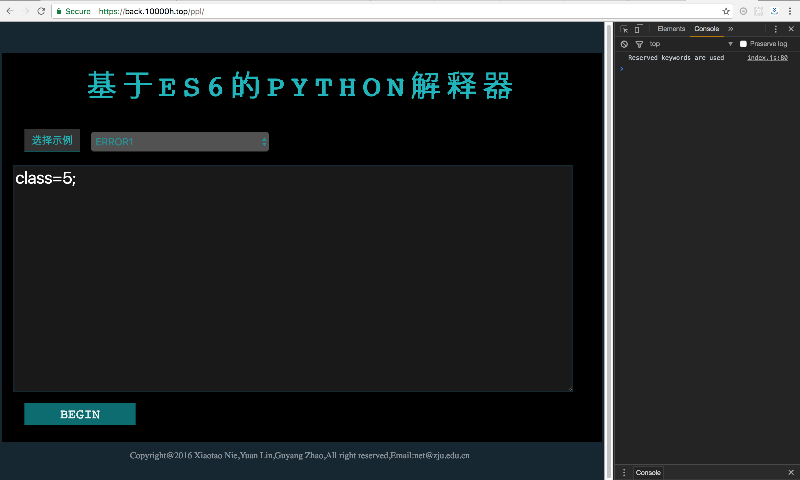

* 错误处理2: 函数在声明前使用（因为我们并不存在变量提升)

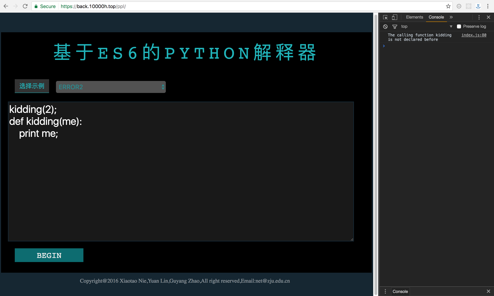

### 实现过程

#### 代码清理

读入全部Python代码后，我们首先去除空行，随后根据换行符切割全部代码，得到数组。接着循环调用函数处理每一句代码（语句块的处理会在函数处理过程中迭代函数实现，具体见下文）
######单句代码的预处理
1. 首先去除句首与句尾的空格（句首的制表符处理在迭代前完成），如果句尾有封号则一并去除。

2. 分词预处理，给特殊字符（如运算符号）以及变量之间加上空格，如果有，==，+=，**，//等多个字符构成特殊字符的情况，，需要特殊处理。

3. 分词，根据空格切割句子，通过之前的预处理，可以得到一个words数组。

4. 整合字符串，由于字符串中很可能带有空格，而分词是根据空格切割的语句，所以需要整合字符串。这步开始直接处理words数字里的单词，不再操作读入的原语句

5. 去除words数组中的空元素，虽然之前把多个连续空格替换为单个空格，但为了以防万一，再次处理。

6. 处理特殊运算符，为了之后处理方便，先把 +=， ++， -- 等运算符转化为 变量 = 变量 + （原等号右侧式子）， 变量 = 变量 + 1 的形式。
######语句处理
1. 首先需要判断关键字，因为关键字都出现在句首，而且可能涉及语句块的判断与处理。我们的关键字有：def, if, for, while, print 以及 return。只需要判断第一个词是否为这几个关键字，并进入分支结构即可。

2. 简单关键字的处理，return 与 print 不涉及到迭代，在token中分好类后，只需要分析关键词后的词，依次存入token即可。

3. 复杂关键字的处理，def， if， for， while都属于语句块，涉及到了迭代的问题。不仅需要在token中存入语句块中余下语句，而且需要考虑语句块中的语句块的情况。

	首先需要在token中分类，随后处理关键字所在行的剩余信息。

	接着读入下一行信息（因为有全部打码的数组存在，所以很容易实现），判断下一行代码的缩进个数，从而判断是否离开了语句块。

	若还在语句块内，则直接迭代句处理函数，并新建子token，将语句块中的语句处理结果装入子token中，最后再将子token装入语句块的token中。

	特别的，对于if语句，由于有elif与else的后续关键字存在，所以需要在语句块分支中处理关键字，直到else结束，再返回完整的token。

	对于elif，我们将其重新包装为新的if……else语句，作为新的属于if的if语句块。

4. 一般赋值语句与三目运算语句的处理，将等号前的变量归类后，将等号后的单词分类，置入token。其中三目运算符虽然只有单行，但类似于语句块的处理，token有复杂结构，需要细致处理。

5. 单词分类，由于有dict， list等复杂变量，所以单词分类时也会涉及到需要读入后续词的情况。

	首先，对于Dict 与 List 因为有{}与[]两个特殊符号，可以最优先处理。
	
	其次，可以分类运算符（有一个包含了所有运算符的字典，可以直接查找，判断是否为运算符）以及字符串。

	再次，当发现读入的词为变量时，需要根据后续判断是否有函数调用。

	最后，可以判断读入的词为数字，根据后续判断是否为浮点数后，直接将字符串转化为数字。
	

#### 生成token
* 打印字符串  
 
```
print "a string";

token ["print",{string:"a string"}]

```

* 打印变量


```
print a;

token ["print",{name:"a"}]

```

* 打印多个变量或者变量加字符串

```
print "a string",a,b,"another string"
token ["print",{string:"a string"},{name:"a"},{name:"b"},{string:"another string"}]

```
---
<div style="background:rgba(0,255,0,0.2)">

* 基本赋值语句    
(js在声明的时候要用"var"来声明，我们做的时候要考虑这一点，第一次出现的时候是声明，其他的时候是赋值，   
也就是说，第一次使用这个变量的话要用var，如果不是第一次使用了要用assign。(第二部分要重复声明一遍，这不是重复，是为了和其他赋值方式保持统一统一处理))


```
a[5] = 123;
token ["var",{['sub',["name","a"],["num",5]],type:"var"},[["num",123]]];


a = 123;
token ["var",{name:"a",type:"var"},[["num",123]]];


//声明之后然后给它赋值
a = 456
token ["assign",{name:"a",type:"assign"},[["num",456]]]

//如果是字符串道理相同：

a = "a string";
token ["assign",{name:"a",type:"assign"},[["string","a string"]]]

//声明之后然后给它赋值
a = "another string"
token ["assign",{name:"a",type:"assign"},[["string","another string"]]]

```

* 语句的基本运算   
这里的基本运算涉及数字之间的四则运算，以及和变量之间的四则运算，直接举例：

```

a = 3 + 5 - 6 * 2;
token ["assign",{name:"a",type:"assign"},[["num",3],["binary","+"],["num",5],["binary","-"],["num",6],["binary","*"],["num",2]]]
//请仔细注意，这里的token和前面有所区分

b = 6;
//这里的token前面写过了，就不重复了

a = b + 2;
token ["assign",{name:"a",type:"assign"},[["name","b"],["binary","+"],["num",5]]

a = 3 * (4 + 5);
token ["assign",{name:"a",type:"assign"},[["num",3],["binary","*"],['binary',"("],["num",4],["binary","+"],["num",5],['binary',")"]]]
//这是一个带括号的，一般也是只会产生小括号，中括号和大括号应该是没有的

```

<div style="background:rgba(255,255,255,1)">


---

* 自增、自减运算符    
对于i++、i--这种的，实际上是独立的语句块，我们解析的时候，首先把它转化成i=i+1和i=i-1再用上面的规则解析，就不重新定义规则了。

* 三目运算符  
三目运算符通常只有一行，但是也有点复杂，应该这样分：也是一开始一个标志符，之后是被赋值的目标，之后是一个三个元素的数组，三个元素分别是：判断条件、前一个代码块，后一个代码块,这里面的前一个代码块和后一个代码块通常是算式,需要按上面解析语句基本运算的方式去解析。

```
a = b > 2 ? 3 : 4;
token ["conditionAssign",{name:"a",type:"assign"},[
 [["name","b"],["binary",">"],["num",2]],
 [
 	["num",3]
 ]
 [
 	["num",4]
 ]
]]

//如果是第一次出现，type的assign应该改成“var”
```


* 语句块：if else      
我们的最基本的if else应该是这样的：整个if else语句块虽然占多行，但是应该写在一个token里，这算一整块，解析AST树的时候这也应该在一个节点下面。

```
if(a<1){
    a = 2;
    a = 3;
}
else{
    a = 0;
}

//这里的token有四块内容，依次是：标志符"if"，判断的内容，if里面的内容，else里面的内容，if里面的内容和else里的内容实际上比较复杂，因为是一个语句块，之后解析的话可能很多个token组成一个token数组，来表示这个语句块，所以这里面要用一个函数的递归

token ["if",
[["name","a"],["binary","<"],["num",1]],
[
      ["assign",{name:"a",type:"assign"},[["num",2]]],
      ["assign",{name:"a",type:"assign"},[["num",3]]]
],[
	  ["assign",{name:"a",type:"assign"},[["num",0]]]
]]

带有elif的：相当于 if(){...}else{if(){...}else{...}} elif相当于语法糖

if(a<1){
    a = 2;
    a = 3;
}
elif(a>3){
    a=5;
}
else{
    a = 0;
}

token :
["if",
[["name","a"],["binary","<"],["num",1]],
[
      ["assign",{name:"a",type:"assign"},[["num",2]]],
      ["assign",{name:"a",type:"assign"},[["num",3]]]
],[

	["if",
	[["name","a"],["binary",">"],["num",3]],
	[
	      ["assign",{name:"a",type:"assign"},[["num",5]]]
	],[
		  ["assign",{name:"a",type:"assign"},[["num",0]]]
	]]

]]


```

* 语句块：for循环    
for 循环是一个涵盖多行的语句块，也是写在一个大的token里，也可能用到函数递归，甚至for循环里还有if/else等其他语句块。

```
for(i = 0;i<4;i++):
    print("abc");
    print("def");


//这里的token应该有五项内容，分别是：标志符"for“，for循环判断条件里的三块内容[这里我们默认每一个块只有一句话，也就是只有一个token(其实判断语句根本不是一个独立的句子，这里稍微扩展了一下概念)]，语句块内容。

token ["for",
["assign",{name:"i",type:"assign"},[["num",0]]],
[["name","i"],["binary","<"],["num",1]],
["assign",{name:"i",type:"assign"},[["name","i"],["binary","+"],["num",1]]],
[
	["print",{string:"abc"}],
	["print",{string:"def"}]
]]


增加：实际上python的for循环不应该是这样子，但是我们自己的python版本出于之后的演示方便，应该把上面的实现，然后对于不是上面的，主要有以下几种:

[py有规定，这里我们遵守：in 前面只能有一个变量，in后面的各种形式下面已经列出]

for i in range(100)
   a = 2;
   a = 3;
   
token["forin",["name","i"],
["call",["name","range"], [["num",100]] ],
[
  //语句块内容省略
]
]
   
for i in range(50,100)
   a = 2;
   a = 3;
   
token["forin",["name","i"],
["call",["name","range"], [["num",50],["num",100]]],
[
  //语句块内容省略
]
]
   
for x in [ 2, 3, 4, 5]:
	a = a + x;

token 	["forin",["name","x"],
["array",[["num",2],["num",3],["num",4],["num",5]]],
[
  //语句块内容省略
]
]

for x in sv   //注: sv是某一个类似list的变量
   a = a + x;
   //或者 a = a + sv[x]

token 	["forin",["name","x"],
["name","sv"],
[
  //语句块内容省略
]
]


```
 
* 语句块 while循环    

```
while(i<6){
    i++;
}

//这里的token有三项内容，分别是"while"标志符，判断条件，默认是一条语句，可能有好多内容...

token ["while",
[["name","i"],["binary","<"],["num",6]],
[
 ["assign",{name:"i",type:"assign"},[["name","i"],["binary","+"],["num",1]]]
]]
```

* 函数    
函数本身的声明部分，对于转化成token应该是不难的，但是函数应当设计一个局部作用域的问题，这个是从token到AST树的生成都要考虑的问题，前面讲过的“var”和“assign”，也就是说，在解析函数的时候，应该生成一个局部变量列表。

这里进行一个举例

```
x = 50
def func(x,y):
    print('x等于', x)
    x = 2
    print('局部变量x改变为', x)
    return x
    
//函数的token分为这几部分：函数标志符号 “defun” 、函数名、变量数组、语句块

token [
"defun",
{name:"func"},
["x","y"],
[
	["print",{string:"x等于"},{name:"x"}],
	["var",{name:"x",type:"var"},[["num",2]]],
	["print",{string:"局部变量x改变为"},{name:"x"}],
	["return",[["name","x"]]]
]]

//注意：函数里面局部变量的改变，不影响全局变量
```

* 函数调用   
函数调用本身是一个表达式或者一个表达式的一部分，我们在这里把函数当作一等公民(简单地理解一等公民的意思，就是函数调用可以像变量一样到处使用)

函数调用的标志符是"call"

以下是具体例子：

```

f1(3,4,5);
token ["call",["name","f1"], [["num",3],["num",4],["num",5]]]

var d = f1(3,4,5) + 2;
token ["advanceAssign",
{name:"d",type:"var"},
["call",["name","f1"], [["num",3],["num",4],["num",5]]],
["binary","+"],
["num",5]
]

a = b > 2 ? 3 : f1(3,4,5);
token ["conditionAssign",{name:"a",type:"assign"},[
 [["name","b"],["binary",">"],["num",2]],
 [
 	["num",3]
 ],
 [
 	["call", [name,"f1"], [["num",3],["num",5]] ]
 ]
]]

```


AST树在js中实际上是一个非常复杂的数组，我们根据生成的token不同不同类型采用了不同的处理方式。这里我对个别重点进行解释：


* AST树的结构

我们采用递归块的形式创建AST树的结构，每一个语句都是根结点下的一个节点，同时每一个字节点也可以挂载若干字节点，整体样例如下：

```
├─ 0: toplevel
└─ 1
   ├─ 0
   │  ├─ 0: stat
   │  └─ 1
   │     ├─ 0: call
   │     ├─ 1
   │     │  ├─ 0: dot
   │     │  ├─ 1
   │     │  │  ├─ 0: name
   │     │  │  └─ 1: console
   │     │  └─ 2: log
   │     └─ 2
   │        └─ 0
   │           ├─ 0: string
   │           └─ 1: hello world
```
在入口函数(即/control/convert.control.js的entrance函数)中逐条分析token生成AST树。

* 复杂运算

我们以下类型变量都可以参与运算：

```
['num','call','name','string','array',"map","set","new","sub"];
```

运算符优先级规则如下：

```
    "(": 1,
    ">>": 2,
    "<<": 2,
    "&": 2,
    "|": 2,
    "*": 2,
    "/": 2,
    "%": 2,
    "+": 4,
    "-": 4,
    "<": 8,
    ">": 8,
    "==":8
    "&&":9
    "||":10
```

之后我们先转化为后缀表达式，然后再转化成AST表达式树(具体代码详见附件，这里给出框架)：

```
function inOrderToPost(original){
    var stack = [];
    var result = [];
    var tempIndex;

    for(var ii = 0; ii < original.length; ii++){
 		//循环处理
       //此处代码省略
    }
    while(stack.length){
        result.push(stack.pop());
    }
    // console.log("post result:\n",result);
    return result;
}

//根据后缀表达式构造出一个AST树需要的表达式树
function PostToTree(original){
    var stack = [];
    var result = [];
    var tempIndex;
    var tempSubTree,tempSubTree1,tempSubTree2;
    for(var ii = 0; ii < original.length; ii++){
       //循环处理
       //此处代码省略
    }
    return result[0];

}
```

* 函数和其他类型变量

我们维护了一个函数池和变量池(不包括函数，虽然函数也是变量)，来保存当前作用域函数和变量的信息，这样就可以在函数或者变量被调用的时候分析是不是已经被定义，也可以在变量被赋值的时候确定该变量是不是第一次被赋值(实际上在token处理的过程中已经考虑到该情况)

```
//函数池，存储函数信息
var functionPool = [];

//数据池,对应：变量=>类型
var dataPool = new Map();
```

### 解释执行

我们可以利用之前生成的AST树，直接模拟执行JS代码，也可以根据AST树存储的信息，生成特殊的JS代码交由引擎去执行。

由于我们重写了一些函数作为python的支持函数，实际上这些支持的函数是不能被放入AST树中的，所以生成特殊的JS代码是一种比较方便的方式。

我们生成AST树之后，直接根据节点类型递归遍历即可，下面的函数简明说明了这一点：

```
var walkers = {
        "string": function(str) {
            return [ this[0], str ];
        },
        "num": function(num) {
            return [ this[0], num ];
        },
        "name": function(name) {
            return [ this[0], name ];
        },
        "toplevel": function(statements) {
            return [ this[0], MAP(statements, walk) ];
        },
        "var": _vardefs,
        "const": _vardefs,
        "try": function(t, c, f) {
            return [
                this[0],
                MAP(t, walk),
                c != null ? [ c[0], MAP(c[1], walk) ] : null,
                f != null ? MAP(f, walk) : null
            ];
        },
      
        "new": function(ctor, args) {
            return [ this[0], walk(ctor), MAP(args, walk) ];
        },
     
     
        "assign": function(op, lvalue, rvalue) {
            return [ this[0], op, walk(lvalue), walk(rvalue) ];
        },
        "dot": function(expr) {
            return [ this[0], walk(expr) ].concat(slice(arguments, 1));
        },
        "call": function(expr, args) {
            return [ this[0], walk(expr), MAP(args, walk) ];
        },
        "function": function(name, args, body) {
            return [ this[0], name, args.slice(), MAP(body, walk) ];
        },
    
        "defun": function(name, args, body) {
            return [ this[0], name, args.slice(), MAP(body, walk) ];
        },
        "if": function(conditional, t, e) {
            return [ this[0], walk(conditional), walk(t), walk(e) ];
        },
        "for": function(init, cond, step, block) {
            return [ this[0], walk(init), walk(cond), walk(step), walk(block) ];
        },
        "for-in": function(vvar, key, hash, block) {
            return [ this[0], walk(vvar), walk(key), walk(hash), walk(block) ];
        },
        "for-of": function(vvar, key, hash, block) {
            return [ this[0], walk(vvar), walk(key), walk(hash), walk(block) ];
        },
        "while": function(cond, block) {
            return [ this[0], walk(cond), walk(block) ];
        },
};
```
之后我们可以直接执行指定我们生成的特殊js代码。

### 组员分工
 
查阅资料，完成整体设计，确定我们要实现的功能：小组三人。   
代码清理，生成token(部分)：赵顾阳   
生成token，对接语法树：林远   
构造生成语法树、错误处理、解析执行：聂小涛   
JS重写python默认支持函数：小组三人   
前端界面：聂小涛

